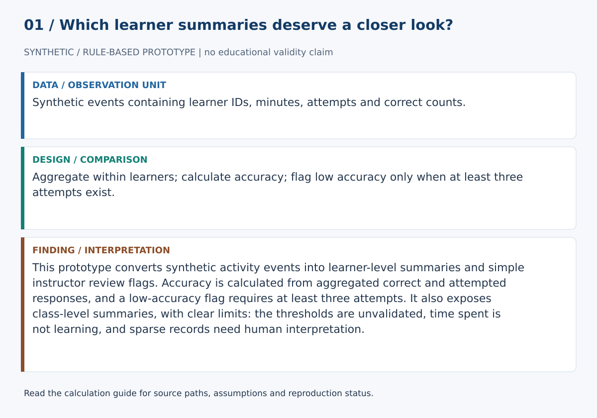
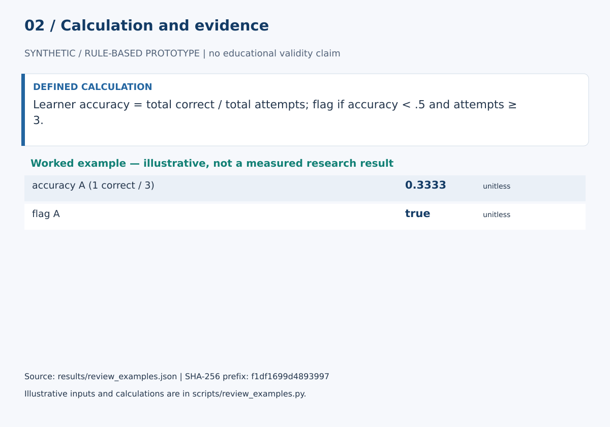

# Instructor Insight Engine

This prototype converts synthetic activity events into learner-level summaries and simple instructor review flags. Accuracy is calculated from aggregated correct and attempted responses, and a low-accuracy flag requires at least three attempts. It also exposes class-level summaries, with clear limits: the thresholds are unvalidated, time spent is not learning, and sparse records need human interpretation.

## Start here

- [Calculations, evidence and verification scope](CALCULATIONS.md)
- [Figure sources and exact numerical paths](docs/figure_spec.json)
- [Data status](data/README.md)





**Review scope:** 6 existing unittest checks passed. The bundled demonstration executed successfully in this review.

## Detailed project documentation

> Teacher-facing aggregation baseline that turns course events into learner summaries, review flags, and class-level signals.

[](https://github.com/devissaputra/instructor_insight_engine/actions/workflows/ci.yml)


**Area:** AI in Education (AIEd) · Learning Analytics & Instructor Decision Support    
**Status:** working research prototype  
**Author:** Devis Saputra

## What this project is for

This project turns raw course events into compact instructor-facing summaries. It focuses on evidence an instructor can act on, such as low accuracy with repeated attempts, while avoiding the temptation to turn every click into a surveillance signal.

**Who may find it useful:** Instructors, learning-analytics researchers, and teams building teacher-facing dashboards.

## Questions for empirical validation

The current aggregation and flagging baseline does not establish instructor usefulness or optimal alert thresholds; those require human evaluation.

1. Which aggregated indicators are actionable for instructors without encouraging surveillance?
2. How should cohort and learner views distinguish signal from noise?
3. How should transparent review flags balance useful coverage with false alarms?

## How it works

The engine aggregates event records by learner, totals time and attempts, calculates accuracy, and applies one explicit review flag: accuracy below 0.5 after at least three attempts. A class summary then reports learner count, flagged count, and mean accuracy.


Course events are reduced to learner level evidence before any flag is created. The final class signals summarize the cohort without hiding the learner records that produced them.


This snapshot shows the bundled synthetic example for Instructor Insight Engine. It checks the software path; it is not an empirical performance result.

## Methods in the current baseline

- event aggregation
- attempt and accuracy summaries
- minimum-evidence flag rule
- class-level aggregation
- human review output

## Data

Synthetic course-event data are included.

`data/README.md` documents the sample schema and the conditions that should be recorded before any real dataset is connected. Restricted or identifiable learner data should stay outside the repository.

## Run the demo

```bash
git clone https://github.com/devissaputra/instructor_insight_engine.git
cd instructor_insight_engine
python scripts/run_demo.py
python -m unittest discover -s tests -v
```

The synthetic demo contains two learners. It prints both learner summaries and a class summary, including one learner flagged for review.

## What to evaluate next

The next version should test whether these summaries help instructors notice actionable patterns earlier than a raw gradebook. Flag rules should be compared with instructor judgments and tuned around real review capacity.

## Evaluation view


The Instructor Insight Engine dashboard is an evaluation checklist rather than a result chart. The bars are illustrative only; the labels show the evidence a real study would need to collect.

## Limits and responsible use

The current flag rule is intentionally simple and should not be interpreted as a diagnosis. Low accuracy can reflect task difficulty, sparse evidence, access barriers, or data quality problems. See `docs/ethics_and_risks.md` for the broader risk review.

## Repository map

```text
.
├── .github/workflows/ci.yml
├── assets/
│   ├── architecture.svg
│   ├── data_flow.svg
│   ├── demo_snapshot.svg
│   └── evaluation_dashboard.svg
├── data/
│   ├── README.md
│   └── sample.csv
├── docs/
│   ├── ethics_and_risks.md
│   ├── related_work.md
│   └── research_protocol.md
├── reports/model_card.md
├── scripts/run_demo.py
├── src/instructor_insight_engine/core.py
├── tests/test_core.py
├── CITATION.cff
├── LICENSE
├── pyproject.toml
└── README.md
```

## Research path

A credible next version would:

1. connect a deidentified course event table with clear event semantics
2. compare rule-based flags with instructor review
3. measure whether the interface changes the timeliness or quality of support

## Related work

`docs/related_work.md` points to open projects that are relevant to this problem area. They are context for comparison and study design; this repository does not present their code as its own.

## Citation and license

`CITATION.cff` contains the software citation. The code and original SVG visuals use the MIT License. Any external dataset keeps its own license and usage conditions.
